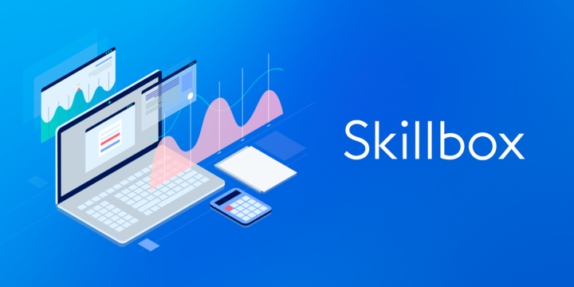

# fullstack-js-by-skillbox

My work/projects according to the training program (by blocks and sub-blocks).

**Let's go!!**

---

### Block: Web-layout "Basic level" // start

- [proj. Lionic](https://s2kdev.github.io/fullstack-js-by-skillbox/Core_Courses/2_Web_Layout_Basic_Level/18_Animation/18_5_Ready-made_solutions)
- [proj. Lagoona](https://s2kdev.github.io/fullstack-js-by-skillbox/Core_Courses/2_Web_Layout_Basic_Level/11_Advanced_CSS_Part_2/11_11_Practical_Work_11_Advanced_CSS)
- [proj. Euclid](https://s2kdev.github.io/fullstack-js-by-skillbox/Core_Courses/2_Web_Layout_Basic_Level/16_Cross_Browser/16_7_Practical_Work_16_Cross_Browser)
- [proj. Grids](https://s2kdev.github.io/fullstack-js-by-skillbox/Core_Courses/2_Web_Layout_Basic_Level/17_Grids/17_7_Practical_Work_17_Grids_v2)
- [**Final work, proj. Blanchard**](https://s2kdev.github.io/fullstack-js-by-skillbox/Core_Courses/2_Web_Layout_Basic_Level/20_Final_work)

---

### [// Click](https://go.redav.online/27b5ac6222df4e81)
